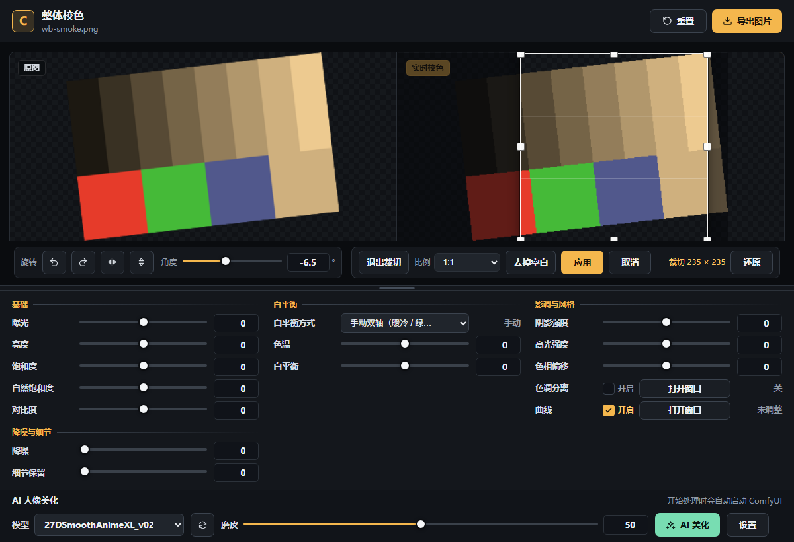
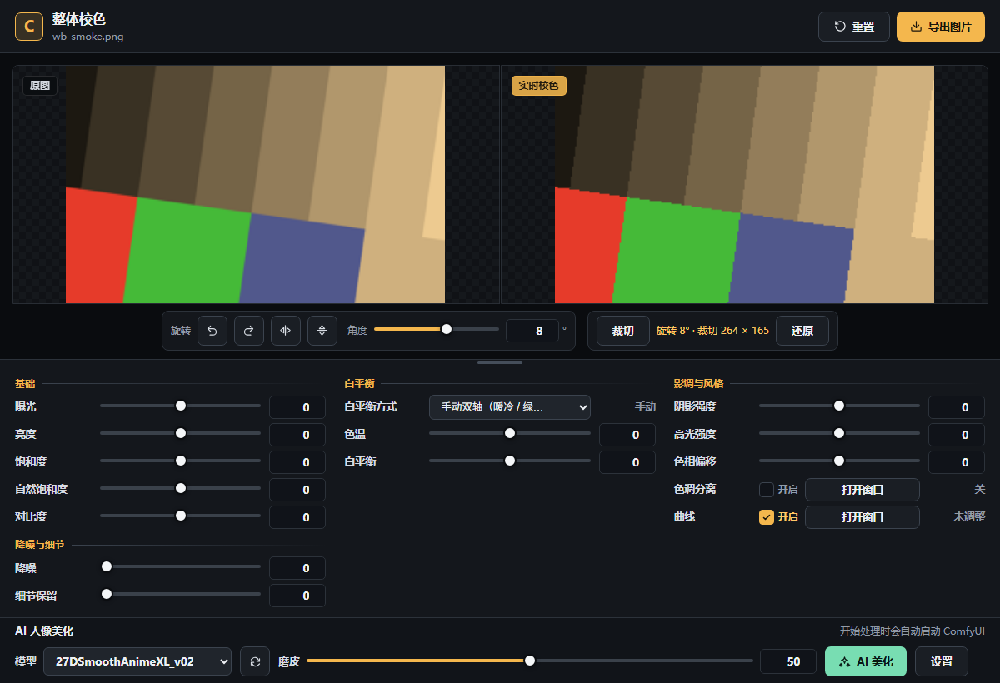
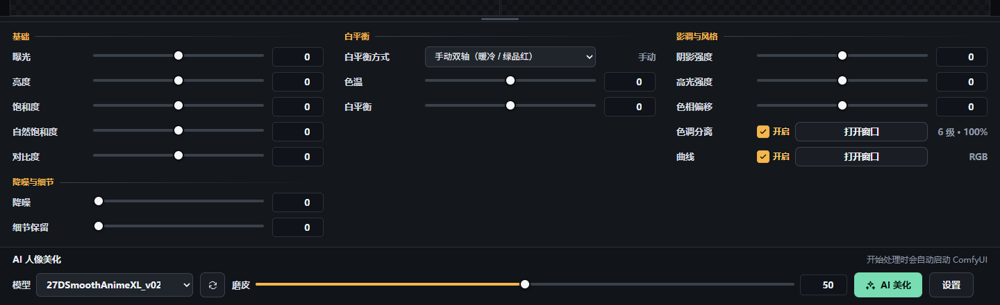
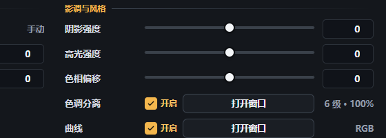
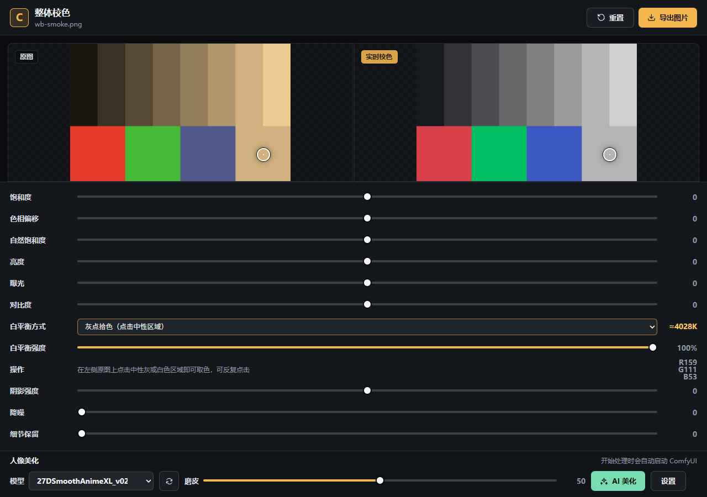
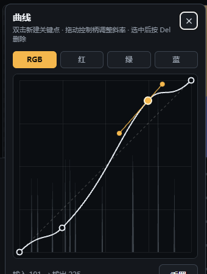
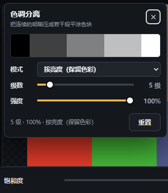
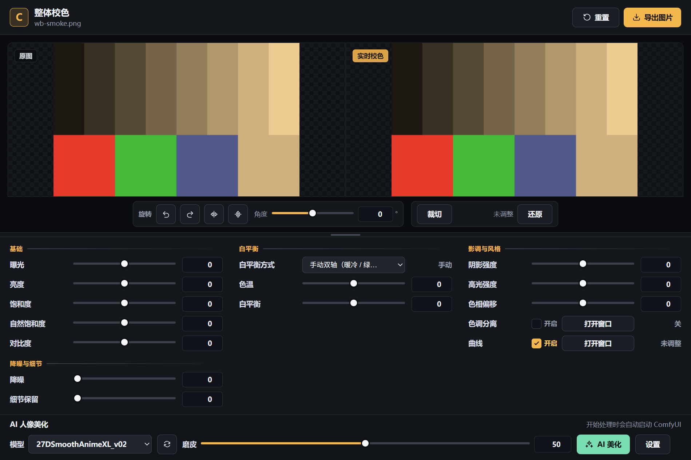

# 整体校色

一个在本机运行、无需安装前端依赖的图片校色与人像美化工具。提供**网页版**与**桌面版**
（`.exe`）两种用法，界面、操作与校色逻辑完全相同。

当前版本 **v1.1.0**，更新内容见 [CHANGELOG.md](CHANGELOG.md)。

## 使用

**桌面版**：解压后双击 `ColorAdjustApp.exe`（单文件版 `ColorAdjustApp-1.1.0-portable.exe`
直接双击即可）。不需要命令行，也不会在后台常驻额外进程，关掉窗口就全部退出。

**网页版**：双击 `start.cmd`。程序会启动本地服务并打开浏览器。建议使用 Chrome 或 Edge。
RAW 解码与 16 位处理依赖 WebAssembly 多线程和 WebGL2，不能直接把 `index.html`
拖进浏览器。

支持拖入、点击选择或粘贴图片，包括：

- 普通图片：JPG、PNG、WebP 等浏览器可读格式
- RAW：ARW、CR2、CR3、DNG、NEF、RAF、ORF、RW2 等 LibRaw 格式

## 校色与降噪

- 饱和度、色相偏移、自然饱和度、亮度、曝光、对比度
- 阴影强度、高光强度
- 降噪：0 到 100，默认 0；为 0 时完全跳过滤波
- 细节保留：0 到 100，默认 0；恢复或增强降噪后的纹理和边缘
- 原图与校色结果实时左右对比
- 按原图分辨率导出；RAW 默认导出 PNG，普通图片可导出 PNG、JPG 或 WebP

RAW 在支持 WebGL2 的浏览器中保持 16 位数据完成校色、降噪和导出渲染；
预览最长边为 2400 像素，最终导出使用原图数据。浏览器不支持 WebGL2 时，
RAW 会提示并降级到 8 位兼容流程。当前导出仍为浏览器支持的 8 位图片格式，
不生成 16 位 PNG 或 TIFF。

处理顺序固定为：RAW 16 位解码、降噪、白平衡、其它色彩调整、曲线、色调分离、旋转与裁切、预览或导出。

## 旋转与裁切



旋转和裁切直接在图片框上完成，工具条就在预览画面下方，左右两侧始终同步，改完立刻生效。

**旋转**

- `↺` / `↻` 每次旋转 90°，裁切框会跟着画面一起转，不会出现「转完画面跑出框外」；
- **角度**滑条（−45°～45°，0.1° 一档）用来拉直地平线，双击恢复 0，右侧数字框可以直接键入角度；
- **水平翻转 / 垂直翻转**：左右、上下镜像；
- 旋转后画面四角没有内容，预览里显示为透明（棋盘底纹），导出 PNG 时保持透明；
- **还原**一次性清掉旋转、翻转和裁切。

**裁切**



点「裁切」进入裁切模式：两侧都显示**整幅**旋转后的画面，右侧叠加裁切框。

- 框外压暗、框内画三分线；四角与四边共 8 个手柄改大小，框内拖动整体平移；
- 在框外压暗区域按下并拖动，可以重新拉一个新框；
- **比例**提供自由、原始比例、1:1、4:3、3:2、16:9、3:4、2:3、9:16，锁定后拖动始终保持比例；
- **去掉空白**：一键把裁切框收成画面里最大的同比例矩形，直接消掉旋转留下的透明边角；
- **应用**按裁切框显示，**取消**回到进入裁切模式前的样子；
- 方向键微调位置（按住 `Shift` 更精细），`Enter` 应用，`Esc` 取消；
- 读数区实时显示裁切后的像素尺寸，例如「旋转 8° · 裁切 264 × 165」。

几何和色彩调整一样参与导出：导出尺寸就是裁切后的像素尺寸，旋转按原图分辨率渲染。
旋转留下的透明角在 PNG / WebP 里保持透明，导出 JPG 时自动垫白底。
AI 美化始终使用未旋转裁切的整幅画面，显示和导出时再套用当前几何，
所以先裁切再美化、或先美化再裁切都不会错位。

## 参数面板



参数按用途分成四组，人像美化单独排在最后，顺序固定为：

1. **基础**：曝光、亮度、饱和度、自然饱和度、对比度
2. **白平衡**：白平衡方式下拉菜单 + 该方式需要的数值（色温、色调、预设、算法、强度、通道增益）
3. **影调与风格**：阴影强度、高光强度、色相偏移、色调分离、曲线
4. **降噪与细节**：降噪、细节保留
5. **AI 人像美化**

**每个滑条都能直接输入数字**

- 滑条右侧是数字输入框：可以直接键入数值，也可以用上下方向键或微调按钮；
- 键入过程中只有落在合法范围内的值才会立即生效，回车或失焦时超范围的值会被夹到范围内；
- 增益滑条按倍率输入（0.25× 到 4.00×），其余滑条按滑条本身的刻度输入；
- 拖动滑条时数字框实时跟随；双击滑条行恢复默认值（数字框在输入时不会被覆盖）；
- 磨皮滑条同样支持数字输入。

**参数面板可以缩放**

- 预览区和参数区之间有一条分隔条，**上下拖动**即可调整参数面板的高度；
- 面板变矮后内部自动出现滚动条，所有参数仍然可用；
- 面板预留预览区的最小高度，不会把画面挤没；
- **双击**分隔条恢复「按内容自适应」；聚焦分隔条后可用 `↑` / `↓` 微调、`Home` 恢复自适应；
- 调整后的高度记在浏览器本地存储里，下次打开仍然生效；
- 窗口足够宽时，四组参数会自动排成多列。

**色调分离与曲线可以一键开关**



两行各带一个勾选框，用来和原图来回对比：

- 取消勾选后效果立即撤掉，画面回到该效果之前的样子，**但所有参数原样保留**；
- 重新勾选，效果立刻按原来的参数恢复，不需要重新调；
- 「打开窗口」按钮负责编辑曲线/色调分离的参数，勾选框只负责开关；
- 标题栏的「重置」会把曲线勾选恢复为开、色调分离恢复为关；色调分离窗口内的「重置」会把勾选重新打开。

## 白平衡



「白平衡方式」下拉菜单提供 7 种调整方式，选中后下方只会显示该方式需要的控件：

| 方式 | 说明 |
|------|------|
| 手动双轴 | 沿用的旧版滑条：色温（暖冷）+ 白平衡（绿品红） |
| 色温 + 色调 | 以开尔文给出色温（2000–12000 K），色调控制绿↔品红；内部使用色温轨迹 + Bradford 色适应 |
| 场景预设 | 烛光、白炽灯、荧光灯、日光、闪光灯、阴天、阴影、蓝天等 12 个预设，可再用色温/色调微调（改动后自动变为「自定义」） |
| 自动分析 | 从画面统计估计光源：灰度世界、Shades of Gray (p=6)、白点 / Max-RGB、白点分位数 97%、灰度边缘 |
| 灰点拾色 | 在左侧原图上点击中性灰或白色区域取色，取 5×5 邻域平均；两个预览都会显示取样标记 |
| RGB 通道增益 | 相机倍率式的 R/G/B 增益，0 = 1.00×，±100 = 0.25× / 4× |
| 关闭白平衡 | 不做白平衡（其它滑条仍然有效） |

- 白平衡统一在**线性光**下用 3x3 色适应矩阵完成，因此中性色校正准确，彩色色相不会漂移；
- 色温 6500 K、色调 0 即不改变画面（sRGB 的参考白点是 D65）；
- 自动分析和灰点拾色会显示「等效色温 + 色调」，可以直接切到色温方式复现同样的效果；
- 「白平衡强度」可以把自动分析和灰点拾色的结果按比例混合回原样；
- RAW 解码阶段已经应用了相机记录的白平衡，这里的方式是叠加在其上的进一步调整；
- 所有白平衡方式的原理、公式与出处，见 [docs/white-balance-methods.md](docs/white-balance-methods.md)。

## 曲线



点击标题栏的「曲线」按钮弹出曲线窗口。窗口是非模态的浮动面板，调整时可以
直接看到右侧画面的变化。

- **直方图**：窗口里画出当前画面的直方图（RGB 通道为亮度直方图，红/绿/蓝通道为对应分量），
  随调整实时刷新，两端因削波产生的尖峰不会把其余部分压平；
- **通道**：RGB（复合）与红、绿、蓝单通道，四条曲线互相独立。复合曲线先作用在三个通道上，
  单通道曲线随后各自映射一次，与 Photoshop 的次序一致；
- **新建**：在曲线区域**双击**即可新建关键点，新点自动带平滑切线；
- **删除**：单击选中关键点，按 `Del` 或 `Backspace` 删除；两个端点不能删除，只能上下拖动；
- **移动**：拖动关键点改变输入/输出，拖动橙色控制柄改变该点的**斜率**（贝塞尔切线，
  进/出两侧独立，可以做出尖角）；
- **读数**：窗口底部显示选中关键点的「输入 → 输出」（0–255）；
- **重置**：窗口内的「重置」只复位当前通道，标题栏的「重置」会清空所有曲线和滑条。

面板里的「曲线」一行带勾选框，可以随时关闭曲线做对比（参数不会丢）。

曲线在其它色彩调整之后生效，用 256 级查找表（256×1 纹理）在着色器里按通道查表，
因此对预览、导出和 AI 输入三种流程同时生效。载入新图片时曲线会和滑条一起重置。

## 色调分离



点击标题栏的「色调分离」按钮弹出窗口，把连续的明暗压成有限段平涂色块（波普 / 海报风格）：

- **分级预览条**：窗口顶部画出当前级数下的色块结构，一眼看出会分成几段；
  按通道模式时分成 R/G/B 三条，没参与分离的通道保持连续渐变；
- **模式**：
  - 按亮度（保留色彩）：只把亮度量化到 N 段，再按比例缩放 RGB，
    色相与饱和度保留，画面变成彩色平涂；
  - 按通道（R/G/B 各自）：Photoshop「色调分离」的做法，三个通道各自量化，
    每个通道可以单独开关，用来做偏色、双色调效果；
- **级数**：2 到 32 段（2 段就是黑白二值），双击滑条恢复 8 级；
- **强度**：0 到 100%，在原始画面和分离结果之间混合，双击恢复 0（关闭）；
- **重置**：窗口内的「重置」回到默认分离效果（8 级 / 100% / 按亮度），
  标题栏的「重置」会把强度归零、彻底关掉；
- 打开窗口时如果还没有效果，会自动套用一次默认分离，点一下就能看到变化。

面板里的「色调分离」一行带勾选框，可以随时关闭做对比（级数、强度、通道都会保留）。

色调分离是整条流程的最后一步（白平衡 → 曝光等调整 → 曲线 → 色调分离），
分级公式 `round(x × (N − 1)) / (N − 1)` 保证黑白场始终映射到自身。

## 人像美化

人像美化通过本机 ComfyUI 的 Impact Pack FaceDetailer 完成，界面只显示模型、
磨皮滑条和状态，不暴露提示词、采样器、步数或 LoRA。

首次使用时点击“设置”，指向包含以下内容的 ComfyUI 安装目录：

- `ComfyUI\main.py`
- `python_embeded\python.exe`
- ComfyUI-Impact-Pack
- ComfyUI-Impact-Subpack
- `face_yolov8m.pt`
- `models\sams` 中至少一个 SAM 模型

配置保存在 `%LOCALAPPDATA%\ColorAdjustApp\comfy.json`。开始 AI 处理时，本地
桥接服务会复用已经在 `127.0.0.1:8188` 运行的 ComfyUI；未运行时以隐藏窗口
启动，并在空闲 10 分钟后关闭由本程序启动的进程。程序不会修改 ComfyUI 的
用户工作流或 `comfy.settings.json`。

没有 ComfyUI 或缺少依赖时，RAW 校色、降噪和普通导出仍可正常使用，只会
禁用“AI 美化”。AI 输入是当前校色和降噪后的 PNG，处理结果先显示在右侧
预览，并永久保存到本工程 `outputs` 文件夹（桌面版保存到 `图片\ColorAdjustApp\`）；
调整滑条、切换模型或载入新
图片会丢弃右侧旧 AI 结果，但不会清除滑条设置，也不会替换左侧原图。
保存成功后状态栏会显示完整路径，“打开结果”在浏览器里查看图片，
“打开文件夹”会在资源管理器中选中该文件；这两个按钮在调整滑条后仍然
可用，方便随时找回结果。文件名取自输入图片，例如 `IMG_0001-AI.png`，
重名时自动追加 `-2`、`-3`。

## 桌面版（.exe）



桌面版把网页版的前端原样装进 Electron 窗口，并内置了原 `serve.ps1` 提供的本地接口，
所以**排版、操作、快捷键、AI 面板都完全一致**，区别只在启动方式与结果落盘位置：

| 项 | 网页版 | 桌面版 |
|---|---|---|
| 启动 | 双击 `start.cmd`（PowerShell 服务 + 浏览器） | 双击 `ColorAdjustApp.exe` |
| 后台 | 需要保持命令行窗口开着 | 无需额外进程，关窗即退出 |
| 界面文件 | `index.html`、`app.js`、各模块 | 同一批文件（仓库里没有第二份副本） |
| AI 结果 | 工程目录 `outputs\` | `图片\ColorAdjustApp\` |
| ComfyUI 配置 | `%LOCALAPPDATA%\ColorAdjustApp\comfy.json` | 同一个文件，两个版本共用 |
| 自检 | `tools/browser-check.html`（浏览器打开） | `ColorAdjustApp.exe --smoke` |

桌面版的实现放在 `desktop/`：`main.js` 是 Electron 主进程，`bridge.js` 提供静态文件与
`/api/` 路由，`comfy.js` 负责 ComfyUI 的配置、启停、上传、轮询与结果归档，
三者的接口契约与 `serve.ps1` 逐条对齐（错误文案也一致，前端的提示不会变）。
细节与构建方式见 [desktop/README.md](desktop/README.md)。

## 操作

- 拖动滑条实时调整，也可以在右侧数字框里直接键入数值
- 双击滑条行恢复该参数的默认值（色温 K 恢复 6500 K，强度恢复 0）
- 拖动预览区与参数区之间的分隔条可以缩放参数面板，双击恢复自适应
- 图片框下方是旋转 / 翻转 / 裁切工具条：`↺` `↻` 转 90°，角度滑条拉直，裁切模式下拖框选范围
- 「灰点拾色」方式下，在左侧原图上点击中性灰或白色区域即可取色，可反复点击
- 曲线窗口：双击新建关键点，单击选中，`Del` 删除，拖动控制柄调整斜率，`Esc` 关闭窗口
- 色调分离窗口：拖动级数/强度，切换模式与通道，`Esc` 关闭窗口
- 裁切模式：方向键微调，`Shift` + 方向键更精细，`Enter` 应用，`Esc` 取消
- `Ctrl+O` 选择图片
- `Ctrl+S` 导出图片
- AI 处理时可再次点击按钮取消

## 开发自测

```powershell
node tools/white-balance.test.js    # 白平衡色彩数学（轨迹、色适应、光源估计）
node tools/geometry.test.js         # 旋转裁切几何（视图矩阵、外接矩形、自动去掉空白）
node tools/curves.test.js           # 曲线数学（贝塞尔、单调性、查找表、直方图）
node tools/posterize.test.js        # 色调分离数学（分级、状态解析、预览条）
node tools/ui-consistency.test.js   # 界面接线、下拉项、色彩模块与版本号的一致性
node tools/wb-diagnostic.js         # 打印各色温下的 3x3 矩阵，便于核对数值
node desktop/test/bridge.test.js    # 桌面版桥接层（自带 mock ComfyUI 跑完整任务流）
```

启动服务后可用无头浏览器打开 `http://127.0.0.1:8765/tools/browser-check.html`，
它会逐项切换白平衡方式并读取 WebGL 结果像素做断言。

桌面版的构建与打包后自检见 [desktop/README.md](desktop/README.md)；打包好的 exe 也可以
直接自检：

```powershell
.\desktop\dist\win-unpacked\ColorAdjustApp.exe --smoke   # 打印 RESULT n/n
```

关闭启动程序的命令行窗口即可停止本地服务。
